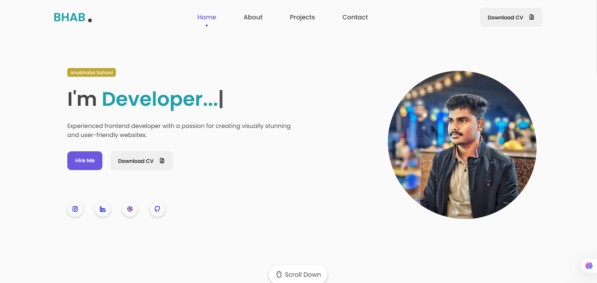

# 💼 My Portfolio

Welcome to my personal portfolio website!  
This project showcases my skills, projects, and contact information as a Web developer.

---

## 🚀 Demo

Check out the live portfolio site here: [Anubhaba's Portfolio :)](https://anubhabasahani-portfolio.netlify.app/)

---

## 🖥️ Tech Stack

- **HTML5**
- **CSS3**
- **JavaScript**
- [Unicons](https://iconscout.com/unicons)
- [Typed.js](https://github.com/mattboldt/typed.js/)
- [ScrollReveal.js](https://scrollrevealjs.org/)
- [EmailJS](https://www.emailjs.com/) (for contact form)

---

## 📂 Project Structure

```
My-Portfolio
│
├── assets
│   ├── css
│   │   └── style.css
│   ├── js
│   │   └── main.js
│   └── img
│       ├── project1.png
│       ├── project2.png
│       └── profile.jpg
│
├── index.html
└── README.md
```

---

## ✨ Features

- **Responsive Design:** Looks great on all devices.
- **Animated Typing Effect:** Dynamic introduction using Typed.js.
- **Smooth Scroll Animations:** Engaging transitions with ScrollReveal.js.
- **Downloadable Resume:** Easy access to my CV.
- **Contact Form:** Send me a message directly (powered by EmailJS).
- **Social Links:** Connect with me on Instagram, LinkedIn, and GitHub.

---

## 📸 Screenshots




---

## 🛠️ Getting Started

1. **Clone the repository:**
   ```sh
    git clone https://github.com/Anubhab-git/My_Portfolio.git
   ```
---

## 📞 Contact

Feel free to reach out if you have any questions or would like to collaborate on a project!

- 📧 Email: [anubhabasahani87@gmail.com](mailto:anubhabasahani87@gmail.com)
- 💼 LinkedIn: [Anubhaba Sahani](https://www.linkedin.com/in/anubhaba-sahani-9b9902294)
- 🐙 GitHub: [Anubhaba-git](https://github.com/Anubhaba-git)
- 📷 Instagram: [@anubhab_sahani](https://www.instagram.com/anubhab_sahani)

---

## 📝 License

This project is open-source and available under the [MIT License](LICENSE).

---

## 👀 Acknowledgments

- Inspiration from other great portfolios
- Documentation of the used technologies
- Support from the developer community
---
